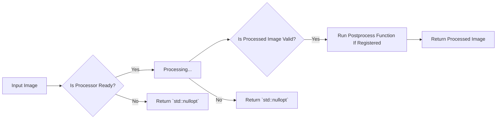

# accelerated_image_processor_common

## Processor Workflow



## How to Register Postprocess Function

```c++ title="How to Register Postprocess Function"
class MyProcessor final : public BaseProcessor
{
public:
  MyProcessor() : BaseProcessor({}) {}
  ~MyProcessor() override = default;

private:
  common::Image process_impl(const common::Image& image)
  {
    // Process the image here
    return image;
  }
};

void do_nothing() { /* Do Nothing */ }

class MyClass
{
public:
  MyClass() {}
  ~MyClass() = default;

  void do_nothing() { /* Do Nothing */ }
};

int main()
{
  auto processor = std::make_unique<MyProcessor>();

  // 1. Register postprocess free function
  processor->register_postprocess(&do_nothing);

  // 2. Register postprocess member function
  auto object = MyClass();
  processor->register_postprocess<MyClass, &MyClass::do_nothing>(&object);
}
```
