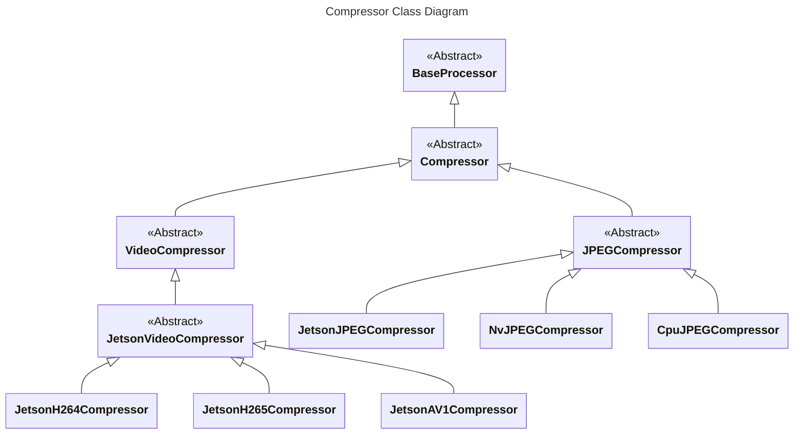

# accelerated_image_processor_compression

This package provides compression functionalities for images using various algorithms.
It also includes support for hardware acceleration on NVIDIA Jetson devices using the Jetson Multimedia API.

## Compressor Supports

| Compressor             | Format | Backend                                                                                  | Device |
| ---------------------- | ------ | ---------------------------------------------------------------------------------------- | ------ |
| `JetsonJPEGCompressor` | `JPEG` | [jetsonJPEG](https://docs.nvidia.com/jetson/l4t-multimedia/classNvJPEGEncoder.html)      | Jetson |
| `NvJPEGCompressor`     | `JPEG` | [nvJPEG](https://developer.nvidia.com/nvjpeg)                                            | GPU    |
| `CpuJPEGCompressor`    | `JPEG` | [TurboJPEG](https://github.com/libjpeg-turbo/libjpeg-turbo)                              | CPU    |
| `JetsonH264Compressor` | `H264` | [NvVideoEncoder](https://docs.nvidia.com/jetson/l4t-multimedia/classNvVideoEncoder.html) | Jetson |
| `JetsonH265Compressor` | `H265` | [NvVideoEncoder](https://docs.nvidia.com/jetson/l4t-multimedia/classNvVideoEncoder.html) | Jetson |
| `JetsonAV1Compressor`  | `AV1`  | [NvVideoEncoder](https://docs.nvidia.com/jetson/l4t-multimedia/classNvVideoEncoder.html) | Jetson |

## Class Interface Diagram



## Example Usage in ROS 2

The following code demonstrates how to leverage the compressor in your ROS 2 codebase:

```c++
#include <accelerated_image_processor_common/datatype.hpp>
#include <accelerated_image_processor_compression/builder.hpp>
#include <accelerated_image_processor_ros/parameter.hpp>

#include <rclcpp/rclcpp.hpp>

using namespace accelerated_image_processor;

class SomeNode final : public rclcpp::Node
{
public:
  explicit SomeNode(const rclcpp::NodeOptions & options) : Node("some_node", options)
  {
    // Instantiate compressor
    auto type = compression::CompressionType::JPEG; // or another compression type
    compressor_ = compression::create_compressor<SomeNode, &SomeNode::publish>(type, this);

    // Update parameters of the compressor
    fetch_parameters(this, compressor_.get(), "compressor");

    // Create a subscription and publisher
    subscription_ = this->create_subscription<sensor_msgs::msg::Image>(
      "~/input/image", 10, [this](const sensor_msgs::msg::Image::ConstSharedPtr msg) { this->callback(msg); });
    publisher_ = this->create_publisher<sensor_msgs::msg::CompressedImage>("~/output/image", 10);
  }

private:
  void callback(const sensor_msgs::msg::Image::ConstSharedPtr msg)
  {
    common::Image image;
    // Convert the message to image...
    compressor_->process(image);
  }

  void publish(const common::Image & image)
  {
    sensor_msgs::msg::CompressedImage msg;
    // Convert the image to message...
    publisher_->publish(msg);
  }

  std::unique_ptr<compression::Compressor> compressor_; //!< Compressor

  rclcpp::Subscription<sensor_msgs::msg::Image>::SharedPtr subscription_; //!< Subscription
  rclcpp::Publisher<sensor_msgs::msg::CompressedImage>::SharedPtr publisher_; //!< Publisher
};
```
